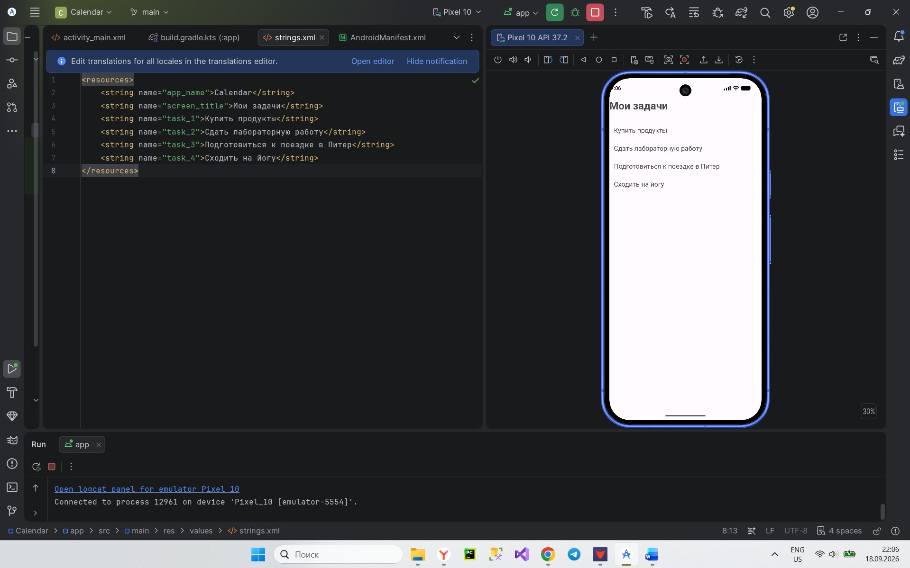
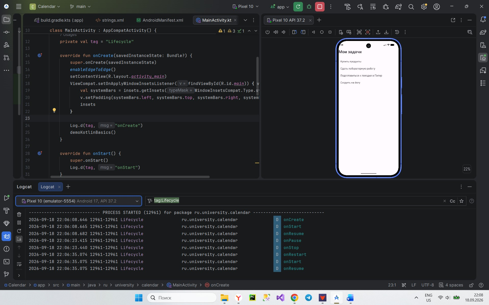

# Отчёт по этапу 1. Настройка окружения и основы Android/Kotlin

**Проект:** Calendar (пакет `ru.university.calendar`), язык Kotlin, minSdk 26 (Android 8.0).

## 1. Что сделано

- Установлена Android Studio с Android SDK, создан и запущен эмулятор (AVD).
- Создан проект «Empty Views Activity» на Kotlin.
- Реализован главный экран: заголовок и 4 задачи-заглушки (`TextView` в `ConstraintLayout`). Тексты вынесены в `strings.xml`.
- В `MainActivity` добавлено логирование всех методов жизненного цикла и небольшая демонстрация `val`, `var` и null safety.
- Проект опубликован в репозитории GitHub.

## 2. Структура проекта

| Файл / папка | Назначение |
|---|---|
| `AndroidManifest.xml` | Описание приложения для системы: название, иконка, тема, список экранов (Activity), разрешения. Помечает `MainActivity` как точку входа (`MAIN` + `LAUNCHER`). |
| `java/.../MainActivity.kt` | Код главного экрана на Kotlin. |
| `res/layout/activity_main.xml` | XML-разметка главного экрана. |
| `res/values/strings.xml` | Все тексты приложения. Вынесены отдельно, чтобы менять и переводить их в одном месте, не трогая код и разметку. |
| `res/values/themes.xml`, `colors.xml` | Тема оформления и цвета. |
| `build.gradle.kts (Module: app)` | Настройки сборки: `namespace`, `applicationId`, `compileSdk`, `minSdk`, `targetSdk`, версия приложения, список библиотек (`dependencies`). |

## 3. Использованные XML-атрибуты

| Атрибут | Что делает |
|---|---|
| `layout_width`, `layout_height` | Размер элемента. `match_parent` — занять всё место родителя (корневой layout занимает весь экран); `wrap_content` — размер по содержимому (высота `TextView` равна высоте его текста); `0dp` в ConstraintLayout — размер определяется ограничениями. |
| `id` | Уникальное имя элемента; `@+id/...` создаёт его, `@id/...` ссылается на существующий. |
| `text` | Выводимый текст; `@string/...` берёт его из `strings.xml`. |
| `textSize`, `textStyle` | Размер шрифта (в `sp`) и начертание (например, `bold`). |
| `padding` | Внутренний отступ элемента (между границей и содержимым). |
| `layout_marginTop` | Внешний отступ (между элементом и соседом). |
| `layout_constraintTop_toTopOf`, `..._toBottomOf`, `Start_toStartOf`, `End_toEndOf` | Ограничения ConstraintLayout: к какому краю родителя или другого элемента привязан край данного элемента. |
| `tools:context` | Подсказка для редактора студии, к какому экрану относится разметка; в приложение не попадает. |

## 4. Жизненный цикл Activity

| Метод | Когда вызывается | Зачем нужен |
|---|---|---|
| `onCreate()` | Экран создаётся (один раз за жизнь) | Подключить разметку, начальная настройка |
| `onStart()` | Экран становится видимым | Подготовка к показу |
| `onResume()` | Экран на переднем плане, с ним можно взаимодействовать | Запуск того, что нужно только при активном экране |
| `onPause()` | Экран теряет фокус или сворачивается | Сохранить то, что нельзя потерять |
| `onStop()` | Экран больше не виден | Освободить ресурсы, ненужные в фоне |
| `onRestart()` | Экран возвращается из состояния «остановлен» | Перед повторным `onStart()` |
| `onDestroy()` | Экран уничтожается | Окончательная очистка ресурсов |

**Наблюдения в Logcat:**
- запуск: `onCreate` → `onStart` → `onResume`;
- сворачивание (Home): `onPause` → `onStop`; возвращение: `onRestart` → `onStart` → `onResume`;
- закрытие (Back): `onPause` → `onStop` → `onDestroy`;
- поворот экрана: Activity уничтожается и создаётся заново (`onDestroy` → `onCreate`), поэтому данные, хранящиеся в самой Activity, теряются. 

## 5. Основы Kotlin

- `val` — неизменяемая переменная (как `final`), `var` — изменяемая. `val` рекомендуют использовать по умолчанию: значение нельзя случайно изменить в другом месте программы.
- Типы без `?` не допускают `null`, с `?` (например, `String?`) допускают.
- `?.` — безопасный вызов: если слева `null`, результат `null`, а не падение.
- `?:` (elvis) — значение по умолчанию, если слева `null`.

## 6. Разница между match_parent и wrap_content
- match_parent — когда нужно, чтобы элемент заполнил доступное пространство (например, кнопка на всю ширину экрана).
- wrap_content — когда размер должен определяться содержимым (например, кнопка, которая не должна быть шире текста на ней).

## 6. Скриншоты

Главный экран приложения:

Logcat с жизненным циклом Activity:

