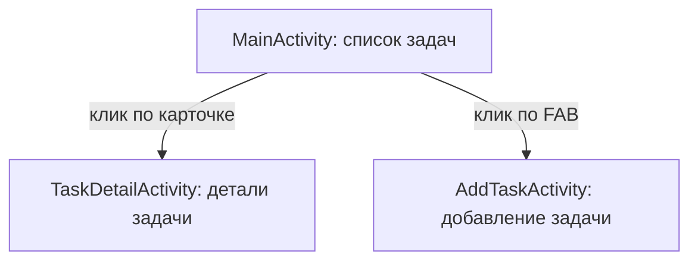

# Схема экранов — этап 2

## Экраны

| Экран | Назначение | Как открывается |
|---|---|---|
| `MainActivity` | Главный экран: список задач через RecyclerView | Запускается при старте приложения (LAUNCHER) |
| `TaskDetailActivity` | Просмотр деталей одной задачи | Клик по карточке в списке; id задачи передаётся через `Intent.putExtra("TASK_ID", task.id)` |
| `AddTaskActivity` | Добавление новой задачи | Клик по FloatingActionButton на главном экране; данные пока не передаются |