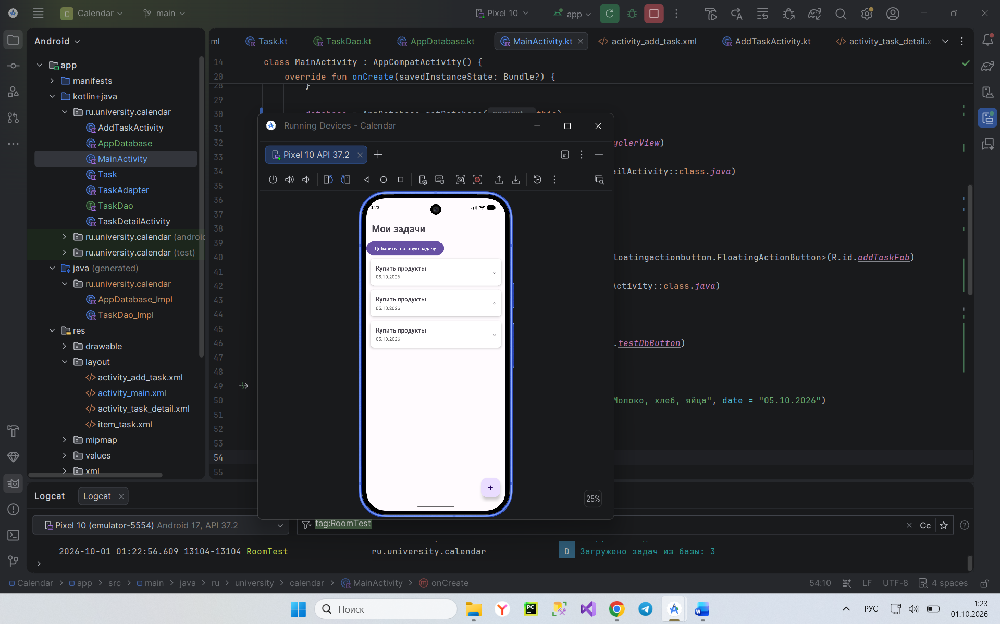
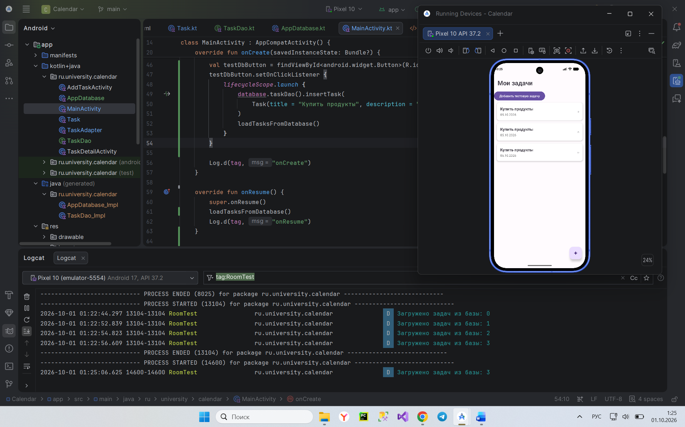

# Отчёт по этапу 3. Локальное хранилище: база данных Room

**Проект:** Calendar (пакет `ru.university.calendar`).

## 1. Что сделано

- Подключена библиотека **Room** (`room-runtime`, `room-ktx`, `room-compiler` через KSP, версия 2.8.4).
- Класс `Task` превращён в Room-**Entity**: добавлены аннотации `@Entity(tableName = "tasks")` и `@PrimaryKey(autoGenerate = true)` для поля `id`; добавлено поле `time`.
- Создан интерфейс **`TaskDao`** с методами: `insertTask`, `updateTask`, `deleteTask`, `getAllTasks`, `getTasksByDate` (выборка по конкретной дате через `@Query`).
- Создан класс **`AppDatabase`** (наследник `RoomDatabase`) с синглтон-доступом через `Room.databaseBuilder()`.
- Список задач на главном экране (`RecyclerView` из этапа 2) переведён с тестового массива в коде на **реальные данные из базы** — загрузка происходит в `onResume()`, чтобы список обновлялся при каждом возврате на экран.
- Проведено тестирование: через временную кнопку в базу добавлялись задачи, а результат подтверждался в Logcat и в самом списке приложения. Также проверено, что данные сохраняются при полном закрытии и повторном открытии приложения.

## 2. Что произойдёт с данными при закрытии и повторном открытии приложения

Данные **сохранятся**. Room хранит их не в оперативной памяти процесса, а в файле базы данных SQLite на диске устройства, в приватной папке приложения. Оперативная память (и вместе с ней процесс приложения) очищается при закрытии, но файл на диске остаётся нетронутым. При следующем запуске `AppDatabase.getDatabase(context)` открывает тот же файл, и все ранее сохранённые записи оказываются на месте.

Это отличается от подхода на этапе 2, где список задач был обычным `List` в коде `MainActivity` — такой список создавался заново при каждом вызове `onCreate()`, а значит, терялся при каждом перезапуске приложения.

## 3. Асинхронность

Все методы `TaskDao` помечены модификатором **`suspend`**. Они вызываются только изнутри корутины — в проекте это `lifecycleScope.launch { ... }`, запущенный из `MainActivity`. `lifecycleScope` автоматически привязан к жизненному циклу Activity: если экран будет уничтожен раньше, чем операция с базой завершится, корутина безопасно отменяется сама. За счёт `suspend`-функций обращение к базе (чтение/запись на диск) никогда не блокирует основной (UI) поток — интерфейс остаётся отзывчивым даже во время операций с базой.

## 4. Room vs «чистый» SQL — в чём удобство

| | `@Query("SELECT * FROM tasks")` в Room | Чистый SQL-подход |
|---|---|---|
| Получение данных | Room сам возвращает готовый `List<Task>` | Нужно вручную открывать `Cursor`, построчно вызывать `cursor.getString(...)` для каждого поля |
| Проверка ошибок | Ошибки в названиях таблиц/столбцов или несовпадении типов Room находит **на этапе компиляции** | Ошибка обнаружится только во время выполнения программы (на устройстве) |
| Повторяющийся код | Не нужен — Room генерирует реализацию DAO автоматически | Код преобразования строк в объекты приходится писать вручную для каждого запроса |
| Защита от SQL-инъекций | Параметры (`:date`) подставляются безопасно самим Room | При ручной склейке строк легко допустить уязвимость |

## 5. Скриншоты

Список задач, полученный из базы данных:

Logcat, подтверждающий чтение задач из базы:

