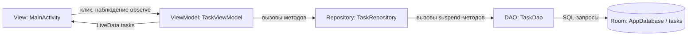

# Схема архитектуры — этап 4 (MVVM)

## Направление потока данных

| Слой | Отвечает за | Знает о |
|---|---|---|
| **View** (`MainActivity`) | Отображение экрана, реакция на клики пользователя | Только о `TaskViewModel` (вызывает его методы, подписывается на `tasks`) |
| **ViewModel** (`TaskViewModel`) | Состояние экрана, бизнес-логика, переживает поворот экрана | Только о `TaskRepository` |
| **Repository** (`TaskRepository`) | Единая точка доступа к данным, скрывает источник данных | Только о `TaskDao` |
| **DAO** (`TaskDao`) | Описание SQL-операций с таблицей `tasks` | Только о `Room` |
| **Model** (`Room: AppDatabase`) | Физическое хранение данных на диске устройства | — |

Чтение данных: `MainActivity` подписывается (`observe`) на `LiveData<List<Task>>` из `TaskViewModel` → `TaskViewModel` при загрузке вызывает `TaskRepository.getAllTasks()` → `TaskRepository` вызывает `TaskDao.getAllTasks()` → `TaskDao` выполняет SQL-запрос к базе `Room`.

Изменение данных: `MainActivity` вызывает метод `TaskViewModel` (например, `addTask`) → `TaskViewModel` вызывает соответствующий метод `TaskRepository` → `TaskRepository` вызывает `TaskDao` → после изменения `TaskViewModel` заново загружает список и обновляет `LiveData`, что автоматически обновляет экран через `observe`.

## Зачем нужен отдельный слой Repository, если ViewModel может обращаться к Dao напрямую

`TaskViewModel` *технически* могла бы вызывать `TaskDao` без посредника — сейчас разница в коде минимальна. Но `Repository` — это единственное место в приложении, которое должно знать, *откуда именно* берутся данные. Если в будущем появится ещё один источник (например, синхронизация с сервером, или кэш в памяти в дополнение к Room), менять нужно будет только `TaskRepository` — `TaskViewModel` и `MainActivity` не заметят изменений, потому что продолжат вызывать те же самые методы (`getAllTasks()`, `addTask()` и т.д.). Это также упрощает тестирование: `TaskViewModel` можно проверять с «поддельным» (fake) Repository, не поднимая настоящую базу данных.
